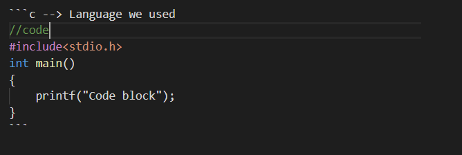

#  Code Block

<br>

<h3> To denote a word or phrase as code, enclose it in backticks (`). </h3>

<br>

### <span style ="color:#68d388" > Example   




## <span style ="color:#51e2f5" > Rendered Output :

<br>

```c --> Language we used
//code
#include<stdio.h>
int main()
{
    printf("Code block");
}
```

<br>

[](Black_Quotes.md)
[](Link.md) 