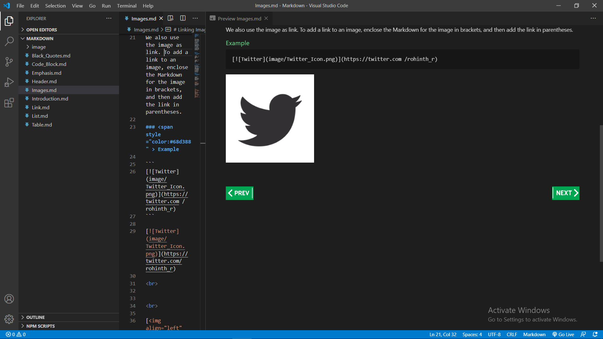

# MarkDown

This repo is to help for learning MarkDown language.

  

# [Introduction](MarkDown/Introduction.md)
  
   - Definition
   - Use
   - Tools

 

# [Emphasis](MarkDown/Emphasis.md)

   - Bold
   - Italic
   - strikethrough 
   
# [Title](MarkDown/Title.md)
  
   - Heading Tag
